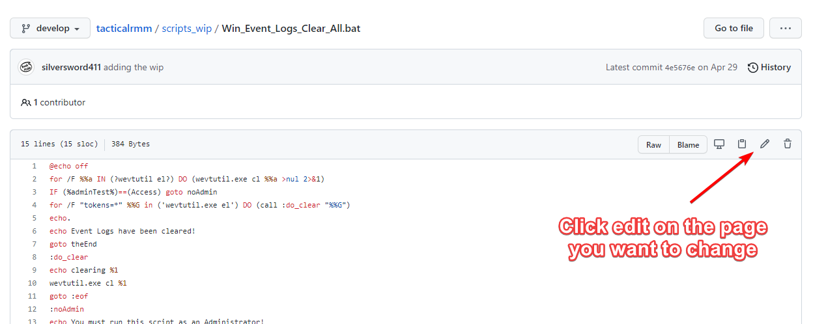

# Contributing Using Web Browser

## Getting Started

### Fork project in Github

This is making a duplicate of the code under your Github that you can edit

<https://github.com/amidaware/tacticalrmm>

### Make edits

Make some changes

### Request your changes to be pulled into the primary repo (Pull Request)

This is taking your changes and requesting they be integrated into the Tactical RMM develop branch.

#### Check the status of your PR

Look at a summary of the changes you've requested, monitor for them to be accepted, or commented on.

<https://github.com/amidaware/tacticalrmm/pulls>

Once they're accepted you can either:
* Delete your fork
* Sync your local fork

#### Sync your fork

Bring changes from original repo to your fork so you're current with changes made in original Github repo:

[...or Official Github Docs](https://docs.github.com/en/github/collaborating-with-issues-and-pull-requests/syncing-a-fork)

#### Lather, rinse, repeat

Go to Step 2. and contribute some more.

## Notes

After your changes are accepted, they won't be live in Tactical RMM until there is a new [release](https://github.com/amidaware/tacticalrmm/releases). #BePatient
