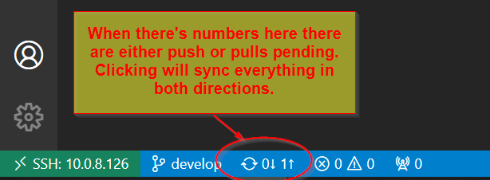

# Contributing Using VS Code

## Getting Started

### Install VS Code

<https://code.visualstudio.com/download>

### Fork Project in Github

This is making a duplicate of the code under your Github that you can edit.

<https://github.com/amidaware/tacticalrmm>


### Add your (forked) repo to VS Code

1. Clone repository.

2. Login to your Github.

3. Choose local folder.

### Install extra VS Code Extensions

- GitLens

- Remote - SSH

### Open Terminal

<https://code.visualstudio.com/docs/editor/integrated-terminal>

```text
Ctrl+`
```

### Configure a remote for your fork (in VS Code)

<https://docs.github.com/en/github/collaborating-with-issues-and-pull-requests/configuring-a-remote-for-a-fork>

Configure your local fork and tell it where the original code repo is so you can compare and merge updates later when official repo is updated.

Check repos:

```bash
git remote -v
```

Add upstream repo:

```bash
git remote add upstream https://github.com/amidaware/tacticalrmm
```

Confirm changes:

```bash
git remote -v
```

## Contribute code

1. Make changes to something.

2. `Commit` (update something) and notate what you did.

3. `Push` (from your local VS Code to your github fork).

4. Open your browser and look at your repo (It should reflect your commit).

### Request your changes to be pulled into the primary repo (Pull Request)


In your browser, create a pull request.

### Sync your local fork

<https://docs.github.com/en/github/collaborating-with-issues-and-pull-requests/syncing-a-fork>

Bring changes from original repo to your local VS Code copy so you're current with changes made in original Github repo:


In VS Code open TERMINAL:

```text
Ctrl+`
```

Tell git to pull from the GitHub upstream repo all new changes into your local directory:

```bash
git pull --rebase upstream develop
```

### Push your local updated copy to your Github fork

Then you're `push`ing that updated local repo to your online Github fork:



### Verify and Repeat

Check your Github fork in browser, it should be up to date now with original. Repeat 6 or 7 as necessary.

*****

## Reference

### Customizing the Admin Web Interface

Created using Quasar, it's all your .vue files in `web/src/components/modals/agents/RunScript.vue`.

Learn stuff here:

<https://quasar.dev/>
