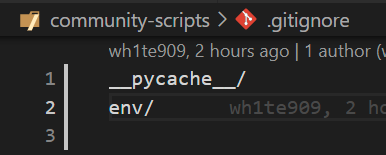
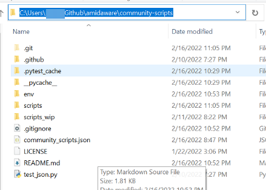
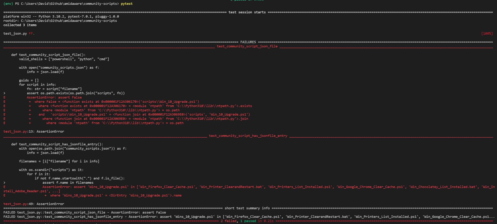

# Dev Notes

## Running Tests with Python for community_scripts tests

There are build/tests everywhere in TRMM, that make sure things haven't gone wrong (like in the `community-script` any file in the `scripts` folder must have a matching entry in .json file. And every field in the .json file should be in the right format, and no duplicates...and .json needs to be properly formatted and...and...and) so there's tests. 

Here's how you run tests locally (make sure python is installed first)

???+ abstract "Running tests from VS Code"

    === ":material-linux: `linux`"

        Open TERMINAL -> SSH 

        Setup python environment

        ```bash
        python3 -m venv env
        source env/bin/activate
        pip install --upgrade pip
        pip install pytest
        ```

        Run tests

        ```bash
        pytest
        ```

    === ":fontawesome-brands-windows: `Windows`"

        - Make sure git isn't going to try and sync your python environment with the repo

        ```
        __pycache__/
        env/
        ```

        

        - Open TERMINAL -> PowerShell Integrated Console (make sure you're in the right path or root of your git folder)

        

        - Setup python env

        ```powershell
        python -m venv env
        ```

        You'll see /env/ folder created in your local folder

        

        Activate your python env

        ```powershell
        .\env\Scripts\activate
        ```

        look for the (env) to appear at the front of your commandline

        

        Upgrade pip to latest, and install `pytest`

        ```powershell
        python -m pip install --upgrade pip
        pip install pytest
        ```

        Run `pytest`

        ```powershell
        pytest
        ```

        Good test

        

        Bad test
        
        

        When done, shut down your python environment

        ```powershell
        deactivate
        ```

        - Summary

        ```powershell
        python -m venv env
        .\env\Scripts\activate
        python -m pip install --upgrade pip
        pip install pytest
        pytest
        ```

        

## Mkdocs build

```bash
python -m venv env
.\env\Scripts\activate
pip install --upgrade pip
pip install --upgrade setuptools wheel
pip install -r ../tacticalrmm/api/tacticalrmm/requirements-dev.txt
mkdocs serve
```
