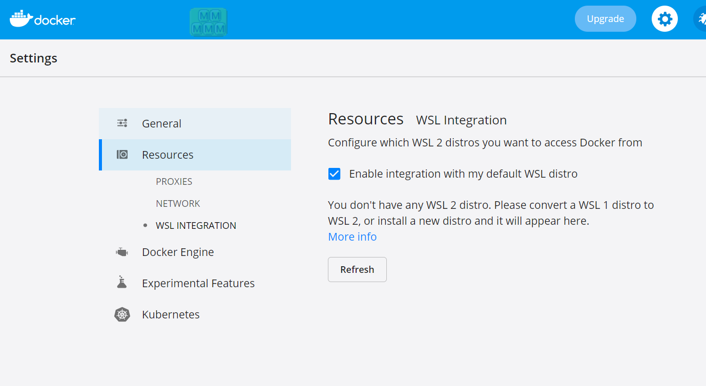

## Install WSL2

https://docs.microsoft.com/en-us/windows/wsl/install-win10


## Install Docker Desktop

https://www.docker.com/products/docker-desktop

### Configure Docker

Make sure it doesn't look like this


This is better


### Check and make sure WSL is v2 and set Ubuntu as default

[https://docs.microsoft.com/en-us/windows/wsl/install-win10#set-your-distribution-version-to-wsl-1-or-wsl-2](https://docs.microsoft.com/en-us/windows/wsl/install-win10#set-your-distribution-version-to-wsl-1-or-wsl-2)


## Create .env file

Under .devcontainer duplicate

```
.env.example
```

as 

```
.env
```

Customize to your tastes (it doesn't need to be internet configured, just add records in your `hosts` file) eg

```
127.0.0.1    rmm.example.com
127.0.0.1    api.example.com
127.0.0.1    mesh.example.com
```

## View mkdocks live edits in browser

Change stuff in `/docs/docs/`

mkdocs is Exposed on Port: 8005

Open: [http://rmm.example.com:8005/](http://rmm.example.com:8005/)

## View django administration

Open: [http://rmm.example.com:8000/admin/](http://rmm.example.com:8000/admin/)