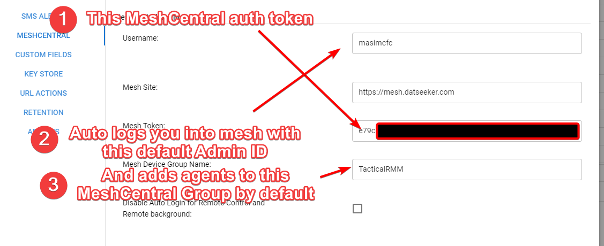

# MeshCentral Integration

## Overview

Tactical RMM integrates with [MeshCentral](https://github.com/Ylianst/MeshCentral) for the following 3 functions:

- Take Control.
- Real time shell.
- Real time file browser.

!!!note

    MeshCentral has issues with Firefox, use a Chromium-based browser.

At some point in the future, these functions will be directly built into the Tactical agent, removing the need for MeshCentral.

It should be noted that Tactical RMM and MeshCentral are 2 completely separate products and can run independently of each other.

They do not even have to run on the same box, however when you install Tactical RMM it simply installs MeshCentral for you with some pre-configured settings to allow integration.

It is highly recommended to use the MeshCentral instance that Tactical installs, since it allows the developers more control over it and to ensure things don't break.

## How does it work?

MeshCentral has an embedding feature that allows integration into existing products.

See *Section 14 - Embedding MeshCentral* in the [MeshCentral User Guide](https://info.meshcentral.com/downloads/MeshCentral2/MeshCentral2UserGuide.pdf) for a detailed explanation of how this works.

The Tactical RMM agent keeps track of your Mesh agents, and periodically interacts with them to synchronize the Mesh agent's unique ID with the Tactical RMM database.

When you do a take control / terminal / file browser on an agent using the Tactical UI, behind the scenes, Tactical generates a login token for MeshCentral's website and then "wraps" MeshCentral's UI in an iframe for that specific agent only, using it's unique ID to know what agent to render in the iframe.

## Running your own existing or separate MeshCentral server?

We do testing to make sure everything works with the version found [here](https://github.com/amidaware/tacticalrmm/blob/master/api/tacticalrmm/tacticalrmm/settings.py) (look for MESH_VER).

Installation instructions for using your own MeshCentral server:

1. Run standard installation.
2. When asked for Mesh URL specify your existing Mesh server URL.
3. After installation, you will need to run thru manually uploading installers and connecting token with [this](troubleshooting.md#need-to-recover-your-mesh-token):
4. Make sure DNS is pointing to your existing server (you must also remove `mesh.yourdomain.com` from `/etc/hosts` on the trmm server).

!!!info
    Mesh usernames are **CaSe sEnSiTive**

## Customize Take Control Username

If you've enabled the Mesh "Ask Consent + Bar" display option that shows across the top when controlling a users machine and you'd like to change the name that users see, login to https://mesh.yourdomain.com, go to **Users**, select **User > Edit** `Real Name`

## MeshCentral Options

There are [MANY](https://github.com/Ylianst/MeshCentral/blob/master/meshcentral-config-schema.json) MeshCentral options that you can configure. Here are some you might want to investigate:

[`allowHighQualityDesktop`](https://github.com/Ylianst/MeshCentral/blob/d06ca601ffde4602f97147038616ed2331f01624/meshcentral-config-schema.json#L135)

[`desktopMultiplex`](https://github.com/Ylianst/MeshCentral/blob/d06ca601ffde4602f97147038616ed2331f01624/meshcentral-config-schema.json#L149)

[`userAllowedIP`](https://github.com/Ylianst/MeshCentral/blob/d06ca601ffde4602f97147038616ed2331f01624/meshcentral-config-schema.json#L151)

[`agentAllowedIP`](https://github.com/Ylianst/MeshCentral/blob/d06ca601ffde4602f97147038616ed2331f01624/meshcentral-config-schema.json#L153)

[`tlsOffload`](https://github.com/Ylianst/MeshCentral/blob/d06ca601ffde4602f97147038616ed2331f01624/meshcentral-config-schema.json#L170) (for proxy users)

[`maxInvalid2fa`](https://github.com/Ylianst/MeshCentral/blob/d06ca601ffde4602f97147038616ed2331f01624/meshcentral-config-schema.json#L260)

## Using Tactical RMM Without MeshCentral

Install Tactical RMM normally. Then, to disable the MeshCentral Server on the TRMM server run:

```bash
sudo systemctl disable --now meshcentral mongod
```

Then when installing an agent, make sure to pass the `-nomesh` flag to the [installer](install_agent.md#optional-installer-args)

## Security Implications

Tactical RMM has a full permission module, but because of how Tactical RMM integrates with MeshCentral currently there is a permissions bypass atm. First, here's how Tactical RMM's integration works. 



With that understanding, when you trigger any function in Tactical RMM that uses a MeshCentral function (Remote Control, or Remote background) the user gets the full admin login Auth token for logging into MeshCentral. If they then goto https://mesh.example.com they will see all agents and have full administrative permissions for everything in MeshCentral.

If you have multiple techs, and need to restrict their computer access permissions, right now you will need to disable auto login and manually manage your meshcentral users and computers. First you will need to:

1. Check the `Disable Auto Login for Remote Control and Remote background:` option.
2. Manually login to MeshCentral, and manually create users and set their permissions/restrictions.
3. All techs will then have to manually login to https://mesh.example.com daily so they can use Remote Control and the MeshCentral Remote Background features.

It is planned at some point in the future for this to either be automated, or eliminated entirely. For now, you will need to handle this yourself.
