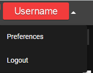
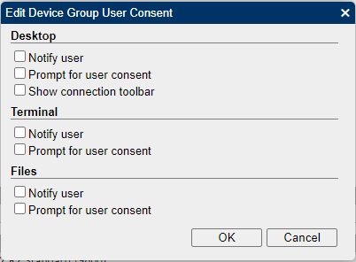
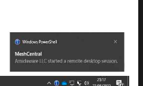

# Tips and Tricks

## Monitor your TRMM Instance via the Built-in Monitoring Endpoint.
Generate a random string to be used as a token and append it to the bottom of `/rmm/api/tacticalrmm/tacticalrmm/local_settings.py` like this:

```python
MON_TOKEN = "SuperSekretToken123456"
```

Then restart Django to activate the endpoint with `sudo systemctl restart rmm.service`

Send a POST request with the following json payload to `https://api.yourdomain.com/core/status/`
```json
{"auth": "SuperSekretToken123456"}
```

Example using curl:
```
curl -X POST https://api.yourdomain.com/core/status/ -d '{"auth": "SuperSekretToken123456"}' -H 'Content-Type: application/json'
```

Response will look something like this:
```json
{
  "version": "0.14.0",
  "agent_count": 984,
  "client_count": 23,
  "site_count": 44,
  "disk_usage_percent": 12,
  "mem_usage_percent": 36,
  "days_until_cert_expires": 47,
  "cert_expired": false,
  "services_running": {
    "django": true,
    "mesh": true,
    "daphne": true,
    "celery": true,
    "celerybeat": true,
    "redis": true,
    "postgres": true,
    "mongo": true,
    "nats": true,
    "nats-api": true,
    "nginx": true
  }
}
```

## Server Monitoring

Monitor Network usage: <https://humdi.net/vnstat/>

Realtime Everything Usage: (_only run when needed because it uses a lot of resources_): <https://learn.netdata.cloud/docs/agent/packaging/installer/methods/kickstart>

## Customize User Interface

At the top right of your web administration interface, click your **Username > preferences**. Set default tab: Servers | Workstations | Mixed



*****

## Use the Filters in the Agent List


*****
## MeshCentral

Tactical RMM is actually 2 products: An RMM service with agent, and a secondary [MeshCentral](https://github.com/Ylianst/MeshCentral) install that handles the `Take Control` and `Remote Background` stuff.

Want to download multiple files?

> ZIP zip's the currently selected file(s) and saves it in the current directory. Then you can download the ZIP. It doesn't download and ZIP on the fly.

If you want to enable automatic clipboard transfers just click the option under [Settings button](https://ylianst.github.io/MeshCentral/meshcentral/devicetabs/#during-a-desktop-session)

### Adjust Settings

Right-click the connect button in **Remote Background > Terminal** for shell options.


Right-click the connect button in **Take Control** for connection options.


### Enable Remote Control Options

!!!note
    These settings are independent of Tactical RMM. Enable features (like auto remove inactive devices) with caution.

1. Remote background a machine then go to mesh.EXAMPLE.COM
2. Click on My Account
3. Click on the device group you want to enable notifications or accept connection etc on (probably TacticalRMM).
4. Next to User Consent click edit (the wee pencil)<br>

5. You can also change features by ticking whatever boxes you want in there (Features: Sync server device name to hostname, Automatically remove inactive devices, Notify/Prompt for Consent/Connection Toolbar settings).<br>

6. Ok your way out

**You will probably now notice a strange name shows when you take control**, to change this 

1. Next to Real Name click edit (the wee pencil)
2. Change or fill in Real Name
3. Click Ok and the name will be changed. <br>



### Agent Online / Offline logs

In mesh from the agent | General Tab


## Scripts

### When Running Scripts

Use the (i) at the end of the script name to:

- Hover: see script parameter syntax help
- Left Click: Opens the script source in Github


## 3rd Party Software Patching

Chocolatey is the default 3rd party software library that is used to populate the software tab. You can install anything that is available at chocolatey.org

If you're interested in converting your software to Chocolatey managed you will need to look at customizing this script <https://github.com/amidaware/community-scripts/blob/main/scripts_wip/Win_Choco_ConvertToChocoManaged.ps1>. If you have improvements please [contribute](https://docs.tacticalrmm.com/contributing_community_scripts/).

Once you've made your script, that will take existing software and convert it to Chocolatey managed (see what Chocolatey manages on an agent with).

```batch
choco list --local-only
```

Next, you're going to schedule your updates. 

Because of [community repo limits](https://docs.chocolatey.org/en-us/community-repository/community-packNeages-disclaimer#rate-limiting), you can [purchase chocolatey](https://chocolatey.org/pricing), [host your own chocolatey server](https://docs.chocolatey.org/en-us/features/host-packages), or use this script sparingly <https://github.com/amidaware/community-scripts/blob/main/scripts/Win_Chocolatey_Manage_Apps_Bulk.ps1> using `-Mode upgrade -Hosts x` where x is the max number of machines on an internet connection.


## Run Intervals for Checks

You can modify at several locations / levels:

* **Settings Menu > Automation Manager > Checks tab >** Edit check
* Agent Level: **Edit Agent > Run checks every**
* Edit Check under agent > Run this check every (seconds)

!!!note
    The interval under check will override agent check if set.
