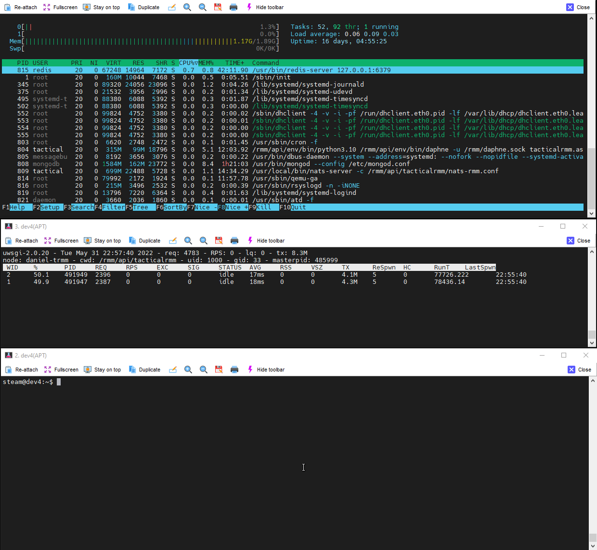

# Tuning for Scale

## Tuning uWSGI
Please read [this blog post](https://www.cloudbees.com/blog/getting-every-microsecond-out-of-uwsgi) to understand how Tactical RMM processes requests with uWSGI (the difference being TRMM  uses Django instead of Flask, which doesn't matter for the purpose of this section).

This article also discusses adjusting the number of uWSGI processes and theads which is what we are going to focus on.

Increasing these values will help your instance handle more requests per second, but setting them too high can actually result in worse performance than a lower value.

## Load Testing TRMM
TRMM's uWSGI config is located at `/rmm/api/tacticalrmm/app.ini`

A lot of the values here can be kept as is but feel free to play around with them. Full list of options [here](https://uwsgi-docs.readthedocs.io/en/latest/Options.html)

We will just focus on `processes` and `threads` for now.

A good place to start (which is the default config that TRMM [generates during install](https://github.com/amidaware/tacticalrmm/blob/c540f802b0d1b2692a0254c868c0cf4f8cfff367/install.sh#L385)) is 1 times the number of CPU cores your instance has for both processes and threads. So if you're running a 2 core CPU VM, the default uWSGI config will be `processes = 2` and `threads = 2`. 

Anytime a change is made to this file, the uwsgi service must be restarted for changes to take effect. This is done with the following command: `sudo systemctl restart rmm`


Use your HTTP load testing tool of choice to hit the TRMM API.<br/>
We will be using [vegeta](https://github.com/tsenart/vegeta) for the following example.

We'll also be using [uwsgitop](https://github.com/xrmx/uwsgitop) to monitor uwsgi in real time.<br/>
Please read [this SO post](https://stackoverflow.com/questions/17163091/how-to-read-uwsgi-stats-output) to understand how to read uwsgitop's output.

## Example load test

Our test server is a Hetzner CPX11 (2 x AMD EPYC @ 2.4Ghz, 2gb ram, 40GB ssd)

On your **trmm server**, install `uwsgitop`:

Edit `/rmm/api/tacticalrmm/app.ini` and add the following line to the bottom of the file:
```
stats = /tmp/stats.socket
```

File should look something like this:
```
tactical@trmm:/rmm/api/tacticalrmm$ cat app.ini
[uwsgi]
chdir = /rmm/api/tacticalrmm
module = tacticalrmm.wsgi
home = /rmm/api/env
master = true
processes = 2
threads = 2
enable-threads = true
socket = /rmm/api/tacticalrmm/tacticalrmm.sock
harakiri = 300
chmod-socket = 660
buffer-size = 65535
vacuum = true
die-on-term = true
max-requests = 500
disable-logging = true
stats = /tmp/stats.socket
```


Install uwsgitop
```
cd /rmm/api/tacticalrmm
source ../env/bin/activate
pip install --upgrade uwsgitop
```

Restart the uwsgi service
```
sudo systemctl restart rmm
```

Run it
```
uwsgitop /tmp/stats.socket
```


Now open another terminal and ssh into a separate linux server that is **NOT** the same server hosting your trmm instance.<br/>
We want to simulate agents connecting over LAN/WAN so while this step can be done from your trmm instance, it is not recommended as results will be skewed.


Download and install vegeta
```
wget https://github.com/tsenart/vegeta/releases/download/v12.8.4/vegeta_12.8.4_linux_amd64.tar.gz -O /tmp/vegeta.tar.gz \
    && tar -xvzf /tmp/vegeta.tar.gz -C /tmp \
    && sudo mv /tmp/vegeta /usr/local/bin/
```

Create a vegeta config file named `trmm.conf` with the following content.<br/>
Make sure to replace `api.example.com` with your subdomain and change the [API KEY](functions/api.md)


```
steam@dev4:~$ cat trmm.conf
GET https://api.example.com/core/version/
Content-Type: application/json
X-API-KEY: IHRQBT2XUBKNEJ42B1E0ZSHJXHMJY7CU
```

We will start with the `/core/version/` endpoint which will serve as our baseline since this is a very basic endpoint that just returns a string and does not hit the database or perform any calculations.

Now let's slam it as fast as we can (rate 0) with 100 workers for 5 seconds:

```
vegeta attack -targets trmm.conf -duration=5s -rate 0 -max-workers 100 | tee results.bin | vegeta report
```




We got 128 RPS (requests per second) with a 100% success rate.

If you had `uwsgitop` running in a another terminal you would also probably see an even distrubution % between the processes with each worker sharing approx 50% of the total load, as shown in the gif above. We want to always make sure we keep an even distrubution. So if we are using 4 processes then we should aim for around 25% per proc.

Now let's try increasing the number of uwsgi procs/threads to something higher, up from 2 procs / 2 threads:

```
...
processes = 10
threads = 20
...
```

Restart the rmm service and run the test again:
```
vegeta attack -targets trmm.conf -duration=5s -rate 0 -max-workers 100 | tee results.bin | vegeta report
```


A little bit better but not much, up to 144 RPS and still 100% success rate.

Let's try with something even higher:

```
...
processes = 20
threads = 25
...
```


As you can see, we actually dropped down to 131 RPS.

If we were to continue we'd start getting less than 100% success rate too.

Now let's try a different TRMM server (BuyVM.net with 4 x Ryzen 9 3900X @3.8Ghz):

```
...
processes = 4
threads = 4
...
```

```
steam@dev4:~$ vegeta attack -targets trmm.conf -duration=5s -rate 0 -max-workers 100 | tee results.bin | vegeta report
Requests      [total, rate, throughput]         1277, 255.31, 239.61
Duration      [total, attack, wait]             5.33s, 5.002s, 327.651ms
Latencies     [min, mean, 50, 90, 95, 99, max]  229.061ms, 404.386ms, 330.467ms, 413.458ms, 1.182s, 1.346s, 1.456s
Bytes In      [total, mean]                     11493, 9.00
Bytes Out     [total, mean]                     0, 0.00
Success       [ratio]                           100.00%
Status Codes  [code:count]                      200:1277
Error Set:
```

Up to 255 RPS due to faster CPU model and more cores.

Keep playing around with this and load testing until you reach the optimal RPS while maintaning an even load distrubution between uwsgi processes. Note that increasing procs and threads will use more RAM so make sure not to overdo it.

Feel free to increase the number of vegeta max-workers to stress it even further and other settings listed [here](https://github.com/tsenart/vegeta#usage-manual)

You should also load test endpoints that hit the database like `/agents/` or `clients/` to see how well your DB performs under load and try to get the most RPS.

Please share your results with the developers on our discord server so we can help make better default configs. Include your total number of agents and clients and the hardware specs of your instance.

