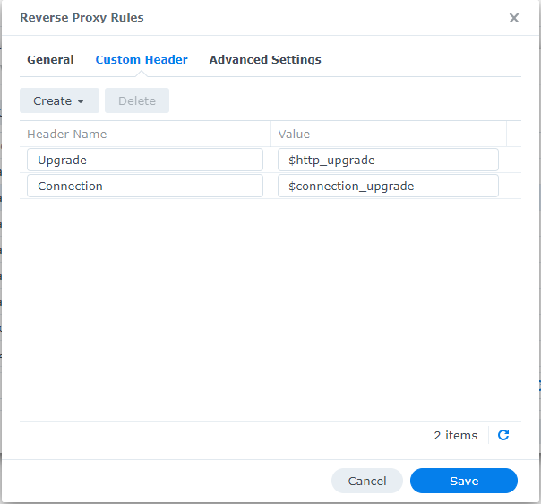
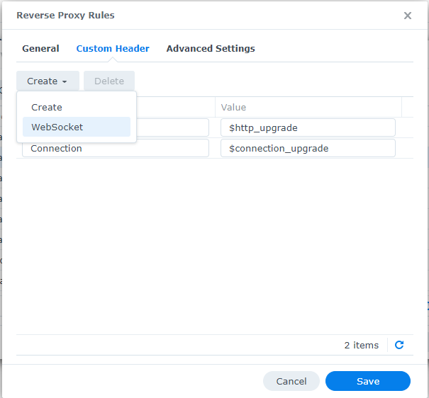

# Unsupported Proxies

!!!note
    Using Proxies/reverse proxies with Tactical RMM is not a supported configuration, the information below is provided here for your reference.

    Although these aren't officially supported configurations, we generally will help point you in the right direction. Please use the Discord [#unsupported channel](https://discord.com/channels/736478043522072608/888474319750066177) to discuss issues related to these complex installations

## General Notes on Proxies and Tactical RMM

### Port 443

Make sure websockets option is enabled.

All 3 URL's will need to be configured: `rmm`, `api`, `mesh`

For `mesh` see the Section 10. TLS Offloading of the [MeshCentral 2 User Guide](https://info.meshcentral.com/downloads/MeshCentral2/MeshCentral2UserGuide.pdf)

### Port 4222

Is NATS (<https://nats.io>). You'll need a TCP forwarder as NATS only talks TCP not HTTP.

## Traefikv2

Offsite Resource: <https://gitlab.com/NiceGuyIT/tactical-goodies/-/tree/main/traefik>

This section will assume that by default Traefik will reverse proxy everything on port 443.

Here is a basic Traefik config with docker-composer note the file.directory and file.watch are important.
```bash
version: "3.7"
services:
  traefik:
    container_name: traefik24
    image: traefik:v2.4 
    restart: unless-stopped
    command:
      - --entryPoints.http.address=:80
      - --entryPoints.https.address=:443
      - --providers.docker=true
      - --providers.docker.endpoint=unix:///var/run/docker.sock
      - --providers.docker.defaultrule=HostHeader(`{{ index .Labels "com.docker.compose.service" }}.$DOMAINNAME`)
      ## This is important, to load the config for RMM and Mesh
      - --providers.file.directory=rules # Load dynamic configuration from one or more .toml or .yml files in a directory.
      - --providers.file.watch=true # Only works on top level files in the rules folder
      ####
      - --certificatesresolvers.dns-cloudflare.acme.dnschallenge=true
      - --certificatesResolvers.dns-cloudflare.acme.email=$CLOUDFLARE_EMAIL
      - --certificatesResolvers.dns-cloudflare.acme.storage=/acme.json
      - --certificatesResolvers.dns-cloudflare.acme.dnsChallenge.provider=cloudflare
      - --certificatesResolvers.dns-cloudflare.acme.dnsChallenge.resolvers=1.1.1.1:53,1.0.0.1:53
    ports:
      - target: 80
        published: 80
        protocol: tcp
        mode: host
      - target: 443
        published: 443
        protocol: tcp
        mode: host
    volumes:
        ##The rules that we will load##
      - $USERDIR/docker/traefik2/rules:/rules 
        ##
      - /var/run/docker.sock:/var/run/docker.sock:ro
      - $USERDIR/docker/traefik2/acme/acme.json:/acme.json
      - $USERDIR/docker/traefik2/traefik.log:/traefik.log
    environment:
      - CF_API_EMAIL=$CLOUDFLARE_EMAIL
      - CF_API_KEY=$CLOUDFLARE_API_KEY
    labels:
      - "traefik.enable=true"
      # HTTP-to-HTTPS Redirect
      - "traefik.http.routers.http-catchall.entrypoints=http"
      - "traefik.http.routers.http-catchall.rule=HostRegexp(`{host:.+}`)"
      - "traefik.http.routers.http-catchall.middlewares=redirect-to-https"
      - "traefik.http.middlewares.redirect-to-https.redirectscheme.scheme=https"
      # HTTP Routers
      - "traefik.http.routers.traefik-rtr.entrypoints=https"
      - "traefik.http.routers.traefik-rtr.rule=HostHeader(`traefik.$DOMAINNAME`)"
      - "traefik.http.routers.traefik-rtr.tls=true"
      - "traefik.http.routers.traefik-rtr.tls.domains[0].main=$DOMAINNAME"
      - "traefik.http.routers.traefik-rtr.tls.domains[0].sans=*.$DOMAINNAME"
```

Before proceeding, we need to change the port 443 to 4430 and 80 to 800 because the port 443 and 80 are already used by Traefik.

Here is a snippet of the only thing you should modify into docker-compose file of the installation.

```bash
  # container for tactical reverse proxy
  tactical-nginx:
    container_name: trmm-nginx
    image: ${IMAGE_REPO}tactical-nginx:${VERSION}
    restart: always
    environment:
      APP_HOST: ${APP_HOST}
      API_HOST: ${API_HOST}
      MESH_HOST: ${MESH_HOST}
      CERT_PUB_KEY: ${CERT_PUB_KEY}
      CERT_PRIV_KEY: ${CERT_PRIV_KEY}
    networks:
      proxy:
        ipv4_address: 172.20.0.20
    ports:
      - "800:80" ## port 800 instead of 80
      - "4430:443" ## port 4430 instead of 443
```
Once save, make sure you run the docker-compose or installation script at least once, so all the directory structure are created.
Once you have your certificate (acme.json) generated by traefikv2 we will be able to extract it for rmm.

Copy the acme.json create by traefik into the root of your rmm directory (In my case its $USERDIR/docker/rmm) which you should have already define.
After that we can run this docker to extract the certificates for us.
```bash
version: "3.7"
services:
##Copy the acme.json of Traefik2 at volumes: (userdir/docker/rmm in this case)
  traefik-certs-dumper:
    image: ldez/traefik-certs-dumper:v2.7.4
    entrypoint: sh -c '
      apk add jq
      ; while ! [ -e /data/acme.json ]
      || ! [ `jq ".[] | .Certificates | length" /data/acme.json` != 0 ]; do
      sleep 1
      ; done
      && traefik-certs-dumper file --version v2 --watch
      --source /data/acme.json --dest data/certs'
    volumes:
      - $USERDIR/docker/rmm:/data
```
Once completed, you should have 1 new folder into you rmm directory $USERDIR/docker/rmm/**certs** in this example.
As the installation instruction, we will pass those to the .env

```bash
echo "CERT_PUB_KEY=$(sudo base64 -w 0 $USERDIR/docker/rmm/certs/certs/**yourdomaine.com.crt**)" >> .env
echo "CERT_PRIV_KEY=$(sudo base64 -w 0 $USERDIR/docker/rmm/certs/private/**yourdomaine.com.key**)" >> .env
```

Next we can create 3 rules to tell traefik to correctly route the https and agent
For that we will create 2 rules into traefik directory as per it configuration. folder/traefik/rules

create 
```bash
nano app-mesh.toml
```
and inside it we add
```bash
[http.routers]
  [http.routers.mesh-rtr]
      entryPoints = ["https"]
      rule = "Host(`mesh.**yourdomain.com**`)"
      service = "mesh-svc"
##middleware with 2fa
[http.services]
  [http.services.mesh-svc]
    [http.services.mesh-svc.loadBalancer]
      passHostHeader = true
      [[http.services.mesh-svc.loadBalancer.servers]]
        url = "https://**xxx.xxx.xxx.xxx**:4430" # or whatever your external host's IP is
```


create
```bash
nano app-meshagent.toml
```
and inside it we add

```bash
[http.routers]
  [http.routers.mesh-rtr1]
      entryPoints = ["https"]
      rule = """Host(`mesh.**yourdomain.com**`) &&
        PathPrefix( `/agent.ashx`, `/meshrelay.ashx`, ) &&
        Headers(`X-Forwarded-Proto`, `wss`) """
    ##Don't add middle where, the agent wont work.    
[http.services]
  [http.services.mesh-svc1]
    [http.services.mesh-svc.loadBalancer]
      passHostHeader = true
      [[http.services.mesh-svc1.loadBalancer.servers]]
        url = "https://**xxx.xxx.xxx.xxx**:4430" # or whatever your external host's IP is

```
create
```bash
nano app-rmm.toml
```
and inside it we add

```bash
[http.routers]
  [http.routers.rmm-rtr]
      entryPoints = ["https"]
      rule = "Host(`rmm.**yourdomain.com**`)"
      service = "rmm-svc"

      ##middleware with 2fa

[http.services]
  [http.services.rmm-svc]
    [http.services.rmm-svc.loadBalancer]
      passHostHeader = true
      [[http.services.rmm-svc.loadBalancer.servers]]
        url = "https://xxx.xxx.xxx.xxx:4430" # or whatever your external host's IP:port is
```

That it, you can now restart Tactical rmm and mesh.yourdomain.com should work, same for the agent.
Please note that if you have a middleware with 2FA you can still use it with the inside mesh.toml but do not add it with the agent.

## HAProxy

Check/Change the mesh central config.json, some of the values may be set already, CertUrl must be changed to point to the HAProxy server.

### Meshcentral Adjustment

Credit to [@bradhawkins](https://github.com/bradhawkins85)

Edit Meshcentral config

```bash
nano /meshcentral/meshcentral-data/config.json
```

Insert this (modify `HAProxyIP` to your network)

```conf
{
  "settings": {
    "Port": 4430,
    "AliasPort": 443,
    "RedirPort": 800,
    "TlsOffload": "127.0.0.1",
  },
  "domains": {
    "": {
      "CertUrl": "https://HAProxyIP:443/",
    }
  }
}
```

Restart meshcentral

```bash
service meshcentral restart
```

### HAProxy Config

The order of use_backend is important `Tactical-Mesh-WebSocket_ipvANY` must be before `Tactical-Mesh_ipvANY`
The values of `timeout connect`, `timeout server`, `timeout tunnel` in `Tactical-Mesh-WebSocket` have been configured to maintain a stable agent connection, however you may need to adjust these values to suit your environment.

```conf
frontend HTTPS-merged
	bind			0.0.0.0:443 name 0.0.0.0:443   ssl crt-list /var/etc/haproxy/HTTPS.crt_list  #ADJUST THIS TO YOUR OWN SSL CERTIFICATES
	mode			http
	log			global
	option			socket-stats
	option			dontlognull
	option			http-server-close
	option			forwardfor
	acl https ssl_fc
	http-request set-header		X-Forwarded-Proto http if !https
	http-request set-header		X-Forwarded-Proto https if https
	timeout client		30000
	acl			RMM	var(txn.txnhost) -m sub -i rmm.example.com
	acl			aclcrt_RMM	var(txn.txnhost) -m reg -i ^([^\.]*)\.example\.com(:([0-9]){1,5})?$
	acl			API	var(txn.txnhost) -m sub -i api.example.com
	acl			aclcrt_API	var(txn.txnhost) -m reg -i ^([^\.]*)\.example\.com(:([0-9]){1,5})?$
	acl			is_websocket	hdr(Upgrade) -i WebSocket
	acl			is_mesh	var(txn.txnhost) -m beg -i mesh.example.com
	acl			aclcrt_MESH-WebSocket	var(txn.txnhost) -m reg -i ^([^\.]*)\.example\.com(:([0-9]){1,5})?$
	acl			MESH	var(txn.txnhost) -m sub -i mesh.example.com
	acl			aclcrt_MESH	var(txn.txnhost) -m reg -i ^([^\.]*)\.example\.com(:([0-9]){1,5})?$
	#PUT OTHER USE_BACKEND IN HERE
	use_backend Tactical_ipvANY  if  RMM aclcrt_RMM
	use_backend Tactical_ipvANY  if  API aclcrt_API
	use_backend Tactical-Mesh-WebSocket_ipvANY  if  is_websocket is_mesh aclcrt_MESH-WebSocket
	use_backend Tactical-Mesh_ipvANY  if  MESH aclcrt_MESH

frontend http-to-https
	bind			0.0.0.0:80   
	mode			http
	log			global
	option			http-keep-alive
	timeout client		30000
	http-request redirect scheme https 


backend Tactical_ipvANY
	mode			http
	id			100
	log			global
	timeout connect		30000
	timeout server		30000
	retries			3
	option			httpchk GET / 
	server			tactical 192.168.10.123:443 id 101 ssl check inter 1000  verify none 


backend Tactical-Mesh-WebSocket_ipvANY
	mode			http
	id			113
	log			global
	timeout connect		3000
	timeout server		3000
	retries			3
	timeout tunnel		3600000
	http-request add-header X-Forwarded-Host %[req.hdr(Host)] 
	http-request add-header X-Forwarded-Proto https 
	server			tactical 192.168.10.123:443 id 101 ssl  verify none 

backend Tactical-Mesh_ipvANY
	mode			http
	id			112
	log			global
	timeout connect		15000
	timeout server		15000
	retries			3
	option			httpchk GET / 
	timeout tunnel		15000
	http-request add-header X-Forwarded-Host %[req.hdr(Host)] 
	http-request add-header X-Forwarded-Proto https 
	server			tactical 192.168.10.123:443 id 101 ssl check inter 1000  verify none 
```

## Apache Proxy
howto -  proxy on apache
### TRMM SERVER
edit file /etc/nginx/sites-available/rmm.conf
add the lines from 'real_ip' module inside server tag:
  

    set_real_ip_from    192.168.0.200; #IP Address of your apache proxy
    real_ip_header      X-Forwarded-For;

restart nginx

    systemctl restart nginx.service

### APACHE
enable ssl proxy, rewriteEngine. 
set proxy to preserve host.
set upgrade rule to websocket.
set proxypass rules redirecting to rmm location

on your apache ssl config
example:

    <VirtualHost *:443>
    	ServerName rmm.blablabla.com.br:443
    	ServerAlias mesh.blablabla.com.br:443 api.blablabla.com.br:443 
    	SSLEngine on
    	
        SSLCertificateFile "C:/Apache24/conf/ssl-rmm.blablabla.com.br/_.blablabla.com.br-chain.pem"
    	SSLCertificateKeyFile "C:/Apache24/conf/ssl-rmm.blablabla.com.br/_.blablabla.com.br-key.pem"
    
     	SSLProxyEngine on
    	
    	RewriteEngine On
    	ProxyPreserveHost On
    	
       	# When Upgrade:websocket header is present, redirect to ws
       	# Using NC flag (case-insensitive) as some browsers will pass Websocket
       	RewriteCond %{HTTP:Upgrade} =websocket [NC]
        RewriteRule ^/(.*)    wss://192.168.0.212/$1 [P,L]
    	
    	ProxyPass "/"  "https://192.168.0..212/" retry=3
    	ProxyPassReverse "/"  "https://192.168.0.212/" retry=3
     	
    	BrowserMatch "MSIE [2-5]" \
    			 nokeepalive ssl-unclean-shutdown \
    			 downgrade-1.0 force-response-1.0

</VirtualHost>

### Updating certificate:
In my case, auto DNS Challenge from apache, so every time we get new cert files, it must be copied inside rmm too.
just overwrite default location:
/etc/letsencrypt/archive/blablablabla
or change certs location on nginx conf to whatever you want.

## nginx Proxy

Having mesh connection issues? 

See <https://info.meshcentral.com/downloads/MeshCentral2/MeshCentral2UserGuide.pdf> page 30.

## Synology NAS reverse proxy portal

Follow [HAProxy](#haproxy)

And set the "CertUrl" to point to the IP address of my NAS that was running the reserve proxy and had the certificates installed.

In Synology NAS reverse proxy portal and added websockets to the rmm domains, especially the mesh domain under custom headers, by just clicking the create button and choosing WebSocket:




