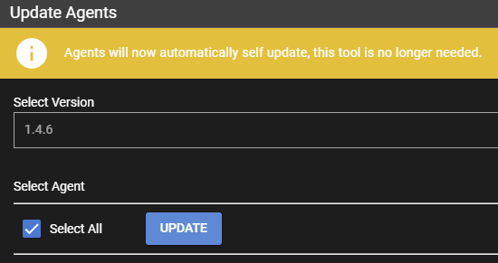

# Updating Agents

!!!warning
    The agent's version is directly tied to the RMM's version.<br/><br/>
    For example, currently RMM version 0.4.17 is compatible with agent version 1.4.6 and lower.<br/><br/>
    You should never attempt to manually update an agent to a newer version without first making sure your RMM is on the latest version.

## Updating from the Web UI

Agents will automatically self update themselves if you have auto self update enabled in **Settings > Global Settings**


There is a background job that runs every hour, at 35 minutes past the hour and sends any online agents an update command if it detects they are on an older version.

You can also trigger this background job to run on demand by clicking **Agents > Update Agents** in the web UI:



You can individually choose which agents to update, or simply Select All.

The RMM will automatically skip any agents that don't need updating.

You can trigger this manual agent update anytime you want. It is safe to spam, and won't run if an agent update task is already running.

It will also make sure agents update to the correct version, in case they are an older version that cannot be directly upgraded to the latest version.

For example, agents older than version 1.3.0 must first be updated to 1.3.0 before they can go any further.

## Manually updating from the command line on the agent

You should never need to do this but might be needed to troubleshoot agents that are not updating automatically.

Download the `tacticalagent-vX.X.X.exe` executable from the [github releases page](https://github.com/amidaware/rmmagent/releases) and place it somewhere on the filesystem.

Open CMD as admin and call the exe like so:

```cmd
C:\Windows\Temp>tacticalagent-vX.X.X.exe /VERYSILENT /LOG=agentupdate.txt
```

This command will return immediately since it spawns a background process to run the update.
The agent will take around 30 seconds to fully update.

You can check the `agentupdate.txt` log file that is created for troubleshooting.
